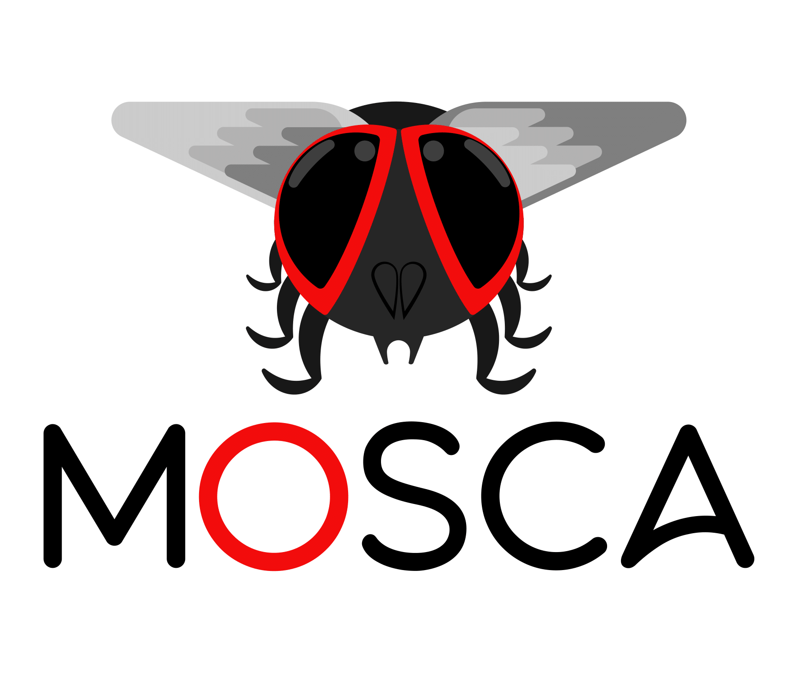

# Meta-Omics Software for Community Analysis

  

   

Welcome to the Meta-Omics Software for Community Analysis (MOSCA) Pipeline!

This pipeline is a powerful tool for analyzing and interpreting meta-omics data, including metagenomics, metatranscriptomics, and metaproteomics. It integrates a variety of state-of-the-art algorithms and visualizations, allowing you to easily and efficiently analyze your data.

#### To get started, check out MOSca's GUI TO perform meta-omics analyses (MOSGUITO):

🌐 https://iquasere.github.io/MOSGUITO

#### For more information on how to use MOSCA and its features, check out our wiki:

📖 https://github.com/iquasere/MOSCA/wiki

#### If you use MOSCA in your research, please cite our publication:

📄 Sequeira, João Carlos, et al. "MOSCA: an automated pipeline for integrated metagenomics and metatranscriptomics data analysis." International Conference on Practical Applications of Computational Biology & Bioinformatics. Springer, Cham, 2018.

#### We hope you find MOSCA helpful in your research endeavors! 🔍
